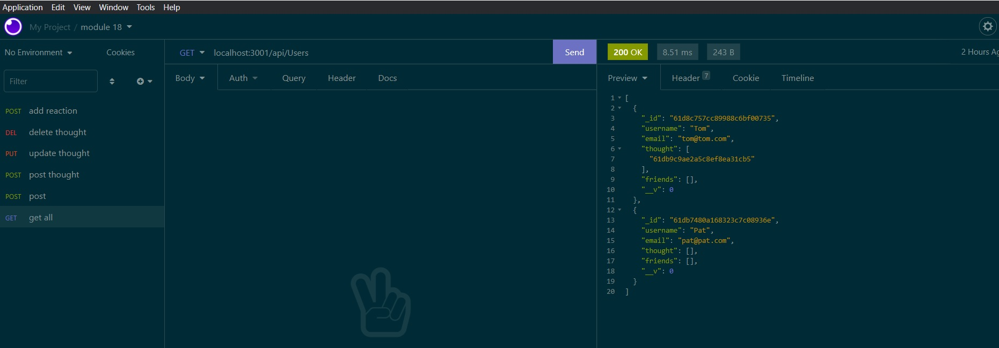

## NOSQL-Media
 
## Description
The user story:

AS A social media startup
I WANT an API for my social network that uses a NoSQL database
SO THAT my website can handle large amounts of unstructured data

Acceptance Criteria
GIVEN a social network API
WHEN I enter the command to invoke the application
THEN my server is started and the Mongoose models are synced to the MongoDB database
WHEN I open API GET routes in Insomnia for users and thoughts
THEN the data for each of these routes is displayed in a formatted JSON
WHEN I test API POST, PUT, and DELETE routes in Insomnia
THEN I am able to successfully create, update, and delete users and thoughts in my database
WHEN I test API POST and DELETE routes in Insomnia
THEN I am able to successfully create and delete reactions to thoughts and add and remove

## Table of Contents
1. [Description](#description)
2. [Installation](#installation)
3. [Screenshot](#screenshot)

## Installation
Install the Dependencies I'm using , which are located in the package.json file. Use 'npm i' to do this.
Once you've done both tasks above you should be able to run the api using the command 'npm start' in the Terminal.
Usage
Here's a link to a walkthrough video of me testing out the API: 

## Screenshot

## Tools Used
Here's a list of the tools that were used to build this API:

Mongoose
Express
Insomnia